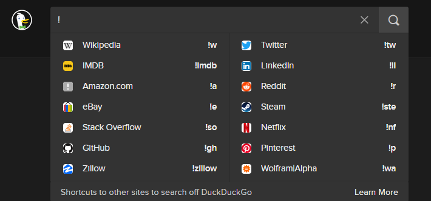
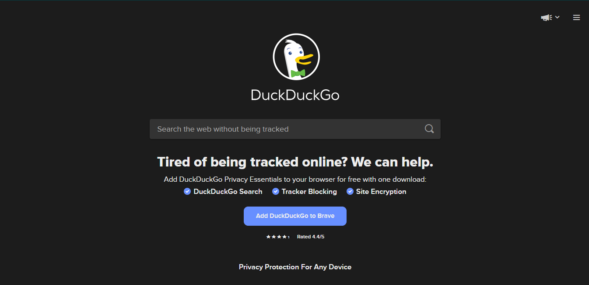

#  {#demo .title_}

Have a question? Just google it! This has a become a common term. Don\'t
get me wrong, I love google results but I don\'t like the google as a
company. Just a simple search tells you all about google\'s advents to
[collect your
data](https://spreadprivacy.com/what-does-google-know-about-me/){.link}
and use it as they like. Google\'s [privacy
policy](https://policies.google.com/privacy){.link} clearly states that
they can use your data as they like. It is not even possible to read
some of these licenses without having the help of a law student! That is
the level of effort put into these licenses. These are not easy like the
[MIT License](https://mit-license.org){.link} or the [GPL
License](https://www.gnu.org/licenses/gpl-3.0.en.html){.link} which are
the mostly used in open source projects, they are written to be
confusing. I won\'t cover why google is bad in the post but I will show
you a very popular alternative to google,
[duckduckgo](https://duckduckgo.com){.link}.

::: img_div
{.img}
:::

# Enter DuckDuckGo {#enter-duckduckgo .heading}

Duckduckgo was one of the first real and usable alternatives to google
and was not just trying to copy google but introduce features which
honestly makes google search look old. Duckduckgo doesn\'t use google
results and show them privately like
[startpage](https://startpage.com){.link} which is another good
alternative for people who want google results but privately, it
actually is a search engine of it\'s own and is slowly gaining
popularity.

::: img_div
{.img}
:::

One disclaimer for people who are believer of the [open
source](https://opensource.org/about){.link} mission, duckduckgo is
closed source, but that doesn\'t mean you can\'t use it with a little
trust. You should never really fully trust any software but open source
projects and some trusted closed source software come pretty close. One
more thing I would like to tell you is duckduckgo results are not always
the best. I mean they are just fine and if your queries are about
technology and other \"techy stuff\", the results I found were very
good. I would go as far to say that they were better that google, but
other queries that were related to academics and social media searchs,
the results were not very good.

::: img_div
{style="max-height: 100%;"}
:::

DuckDuckGo bangs are actually one of the most nifty little features of
duckduckgo that go unnoticed but a seriously addicting. Ever since I
have switch to duckduckgo as my defalut search engine on all the web
browsers I use (I use [brave search](https://search.brave.com){.link}
with brave though 😊), I literaly can\'t use any other search engines any
more without missing duckduckgo. Bangs eliminate the need for useless
bookmarks for google, youtube, github and other major sites. You can
even submit your own at [ddg
bangs](https://duckduckgo.com/newbang){.link}.

::: img_div
{.img}
:::

[Learn More about duckduckgo](https://duckduckgo.com){.link}

So if you are convinced to change now, be sure to prompt duckduckgo as
well, so more people get to know about this awesome alternative to
google search. Thanks for reading. If you want to share this article,
download the pdf below.

::: {style="text-align: center;"}
[🔽Download Pdf](){.btn_text}
:::

------------------------------------------------------------------------

[NoobScience](https://newtoallofthis123.github.io/About){.footer_text}
[Published on
NSBlog](https://newtoallofthis123.github.io/NSBlog){.footer_text}
